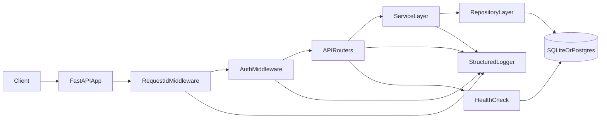
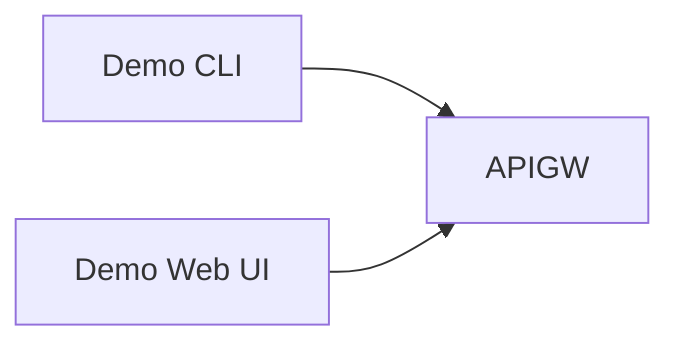
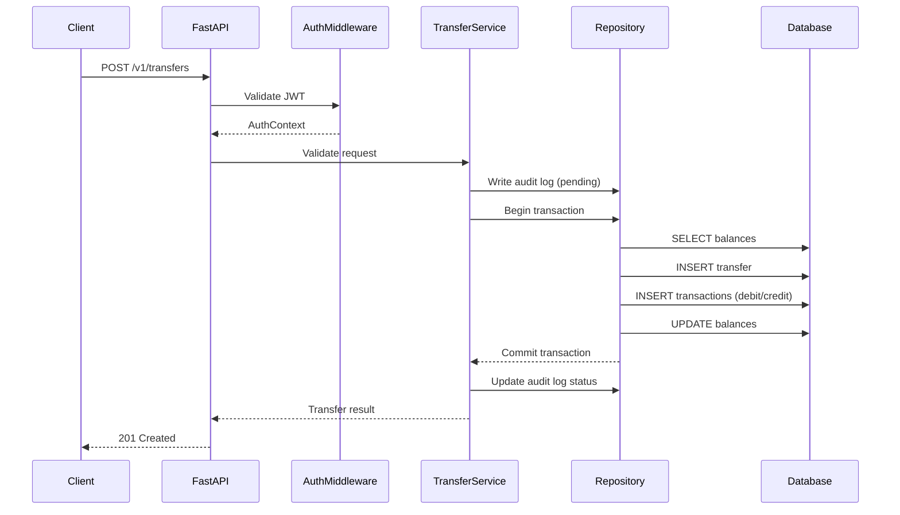

# Architecture — Production‑Ready Banking REST Service

This document describes the system architecture for the banking service, aligned with `FDE_Tech_Assessment_(T2).md`, `TECHNICAL_SPEC.md`, `README.md`, and `MILESTONES.md`.

## Goals and non‑functional requirements
- Production‑ready REST API with health/readiness checks and graceful shutdown.
- Structured JSON logging with correlation IDs.
- SQLite development DB, portable to Postgres.
- Test-Driven Development (TDD) and comprehensive tests (unit + integration).
- Security‑first: no secrets committed, hashed passwords, validated inputs.
- Ubuntu 24.04 compatibility.

## High‑level component view



### Demo clients (bonus)
- `DemoCli` (CLI script) and `DemoWeb` (static UI) act as external clients.
- Both call the same REST API endpoints and use JWT access tokens.
- `DemoWeb` stores access + refresh tokens in memory, shows expiry status, and
  prompts for refresh before expiry (demo-only behavior).



## Runtime data flow
1. **Request received** by FastAPI.
2. **Request ID** assigned/propagated by middleware (`X‑Request‑Id`).
3. **Authentication** enforced on protected routes (JWT validation).
4. **Routing** to specific API handler.
5. **Service layer** performs business logic and validation.
6. **Repository/data access** executes SQLAlchemy operations.
7. **Database transaction** commits/rollbacks.
8. **Response returned**, with structured logs at each step.

## Key subsystems

### API layer
- FastAPI routers under `app/api/`.
- Input validation via Pydantic schemas in `app/schemas/`.
- Standardized error envelope across endpoints.

### Service layer
- Business logic in `app/services/`.
- Encapsulates rules like balance checks, atomic transfers, and ownership validation.

### Data access layer
- SQLAlchemy models in `app/db/models.py`.
- Session management in `app/db/session.py`.
- Alembic migrations in `app/db/migrations/`.

### Auth subsystem
- Password hashing (bcrypt/argon2).
- JWT access tokens (with `sub`, `jti`, `exp`).
- Refresh token rotation with server‑side persistence and revoke support.
- Centralized audit logging for sensitive actions with IP and device ID.
- `JWT_SECRET` must be explicitly set in production (fail fast if unset).

### Observability
- Structlog JSON logs with standard fields.
- Error capture + stack traces.
- Request metrics logged with latency.

### Health/readiness
- `GET /v1/health` checks service + DB connectivity (`SELECT 1`).
- Startup DB health check; fail fast if unhealthy.

## Database schema (extended)

### Tables
**users**
- `id` (PK)
- `email` (unique)
- `hashed_password`
- `created_at`

**account_holders**
- `id` (PK)
- `user_id` (FK → users.id)
- `first_name`
- `last_name`
- `dob`
- `created_at`

**accounts**
- `id` (PK)
- `holder_id` (FK → account_holders.id)
- `type` (checking/savings)
- `currency`
- `balance` (integer minor units)
- `status` (active/frozen/closed)
- `created_at`

**transactions**
- `id` (PK)
- `account_id` (FK → accounts.id)
- `type` (deposit/withdrawal/transfer_in/transfer_out)
- `amount` (integer minor units)
- `currency`
- `created_at`

**transfers**
- `id` (PK)
- `from_account_id` (FK → accounts.id)
- `to_account_id` (FK → accounts.id)
- `amount` (integer minor units)
- `currency`
- `created_at`

**cards**
- `id` (PK)
- `account_id` (FK → accounts.id)
- `type` (virtual/physical)
- `last4`
- `status` (active/blocked)
- `created_at`

**auth_tokens** (extended auth)
- `id` (PK)
- `user_id` (FK → users.id)
- `jti` (unique)
- `issued_at`
- `expires_at`
- `revoked_at` (nullable)

**refresh_tokens** (session management)
- `id` (PK)
- `user_id` (FK → users.id)
- `token_hash`
- `family_id` (rotation group)
- `issued_at`
- `expires_at`
- `revoked_at` (nullable)
- `ip_address`
- `device_id`

**audit_logs** (regulatory compliance)
- `id` (PK)
- `user_id` (FK → users.id)
- `event_type` (login, logout, transfer, card_issue, account_change)
- `resource_type`
- `resource_id`
- `status` (success/failure)
- `ip_address`
- `device_id`
- `metadata` (JSON)
- `created_at`

### Relationships
- User ↔ AccountHolder (1:1)
- AccountHolder ↔ Accounts (1:N)
- Account ↔ Transactions (1:N)
- Transfer references two Accounts and creates two Transactions
- User ↔ AuthTokens (1:N)
- User ↔ RefreshTokens (1:N)
- User ↔ AuditLogs (1:N)

### Consistency rules
- Balances never negative (withdrawals/transfers).
- Transfers are atomic (single DB transaction).
- Monetary values stored as integers in minor units.
- Sensitive actions must write an audit log entry with `ip_address` and `device_id`.

## Sequence diagram — transfer flow



## Folder structure
```
app/
  api/
    routes/
      auth.py
      account_holders.py
      accounts.py
      transactions.py
      transfers.py
      cards.py
      statements.py
      health.py
  core/
    config.py
    logging.py
    security.py
  db/
    models.py
    session.py
    migrations/
  services/
    auth_service.py
    account_holder_service.py
    account_service.py
    transaction_service.py
    transfer_service.py
    card_service.py
    statement_service.py
  schemas/
    auth.py
    account_holders.py
    accounts.py
    transactions.py
    transfers.py
    cards.py
    statements.py
  main.py
tests/
  unit/
  integration/
```

## Operational concerns
- **Startup**: fail fast if DB not reachable.
- **Logging**: JSON with correlation ID and latency.
- **Graceful shutdown**: stop accepting requests, finish in‑flight.
- **Portability**: SQLite in dev, Postgres in prod with minimal changes.
